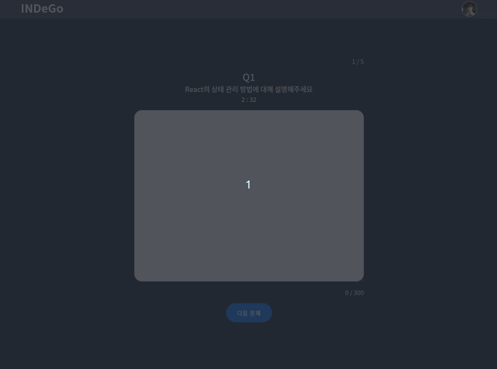

# INDeGo - Interview-Defence-Go
## 💬 About

면접 상황을 대비해 랜덤한 기술 스택 질문에 답변하고, 내 답변과 AI의 답변을 비교해 볼 수 있는 서비스입니다.

기술 면접은 미리 준비를 해도 당황하게 됩니다.  
한 스택, 한 질문씩 준비하는 연습과 달리, 면접은 면접관의 마음에 따라 질문의 경우의 수가 다양해지기 때문이죠.  
실제 면접 전 미리 경험하고 마음의 준비를 할 수 있도록, 본인의 개발 스택에 따라 AI의 랜덤 질문에 대답하는 INDeGo 서비스가 탄생했습니다.  

INDeGo로 모의 면접을 경험하면서 자신감 있는 면접을 준비해보세요 !  

### 🔗 Link

**사이트 바로 가기 👉 [클릭!](https://interview-defence-go-client.vercel.app/)**

 

## 🔍 Preview

|화면|기능|
|:---:|:---:|
||
<b>로그인</b>

깃허브 계정을 이용해 OAuth 로그인 합니다.
|
||
<b>스택 선택</b>

기술 스택을 선택합니다.

선택한 스택을 활용해 chatGPT가 면접 질문 5개 생성합니다.
|
||
<b>질문 답변</b>

chatGPT가 생성한 5가지 질문에 답변합니다.

제한된 시간 내 300자 이내로 답변해야 합니다.
|
||
<b>답변 확인</b>

작성한 답변과 AI의 답변을 비교해 부족한 부분을 보완할 수 있습니다.
|
||
<b>마이 페이지 답변 수정</b>

질문별 답변을 확인하고, 해당 질문에 다시 답변할 수 있습니다.
|

 
 

## 📖 Release Note

|Version|Log|
|:---:|:---:|
|1.0.0|chatGPT를 활용한 랜덤 면접 디펜스 배포|

 

### 📫 업데이트 예정 기능

 
 

## 🛠 Stacks

  
  
  

  
  
  
  
  

  
  
  

 
 

## 🗂 Directory

📦src  
 ┣ 📂@types  
 ┣ 📂apis  
 ┣ 📂asset  
 ┃ ┗ 📂images  
 ┣ 📂components  
 ┃ ┣ 📂GNB  
 ┃ ┣ 📂common  
 ┃ ┣ 📂interviewPage  
 ┃ ┣ 📂mainPage  
 ┃ ┣ 📂myPage  
 ┃ ┃ ┣ 📂answerPreviewComponent  
 ┃ ┃ ┗ 📂modalComponent  
 ┃ ┗ 📂resultPage  
 ┣ 📂data  
 ┣ 📂functions  
 ┣ 📂hooks  
 ┣ 📂pages  
 ┣ 📂react-query  
 ┣ 📂routes  
 ┣ 📂states  
 ┗ 📂styles  
